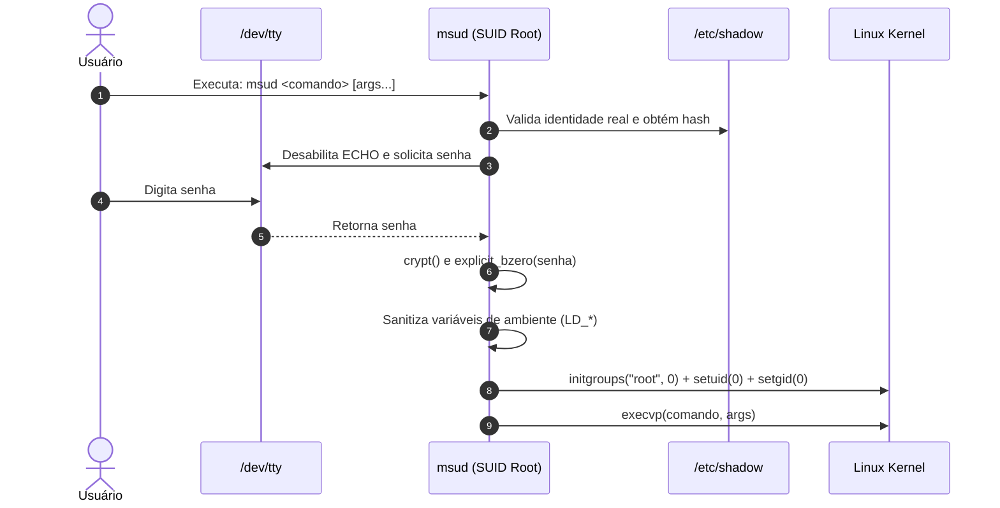

# ⚡ unix

<div align="center">

[](https://github.com/GabrielFrigo4/unix/actions/workflows/ci.yml)
[](LICENSE)
[](https://pubs.opengroup.org/onlinepubs/9699919799/)
[](https://en.cppreference.com/w/c/99)

*Suíte minimalista, segura e auditável de ferramentas e utilitários Unix em C puro.*

</div>

---

## 📖 Visão Geral

O projeto **unix** reúne utilitários de sistema projetados sob a filosofia clássica do Unix: ferramentas focadas, com base de código reduzida, livres de dependências externas inchadas, fáceis de auditar e prontas para rodar em ambientes Linux e FreeBSD.

O utilitário inaugural da suíte é o **`msud`** (*Minimal SUID Doas/Sudo*), uma alternativa ultra-leve e segura aos tradicionais executores de privilégios.

---

## 🧩 Utilitários Disponíveis

| Utilitário | Descrição | Linhas de Código | Plataformas |
| :--- | :--- | :--- | :--- |
| [**`msud`**](msud/) | Executor de comandos com privilégio elevado (alternativa a `sudo`/`doas`) | ~180 LOC | Linux, FreeBSD |

---

## 🏛️ Arquitetura do `msud`



---

## 🚀 Instalação e Compilação

### Pré-requisitos
- Compilador C (`gcc` ou `clang`)
- `make` compatível com POSIX
- Biblioteca de criptografia (`libcrypt-dev` em Linux; nativa na `libc` em FreeBSD)

### Compilação Padrão
```bash
# Compilar todos os utilitários da suíte
make all

# Compilar com sanitizers (AddressSanitizer + UndefinedBehaviorSanitizer)
CC=clang make debug
```

### Instalação no Sistema
Para instalar os binários com bit SUID root (`chmod 4755`) e as manpages correspondentes em `/usr/local/bin`:
```bash
sudo make install
```

---

## 🧪 Quality Gates & Ganchos Git (.githooks)

Para habilitar a validação de formatação (`clang-format`), integridade de whitespace e compilação antes de cada commit:

```bash
chmod 0755 .githooks/pre-commit
git config core.hooksPath .githooks
```

Ou simplesmente execute o instalador automatizado:
```bash
./.githooks/install.sh
```

Para rodar a verificação manual de qualidade:
```bash
make check
```

---

## 📚 Documentação Técnica

- 🏛️ [**ARCHITECTURE.md**](docs/ARCHITECTURE.md): Análise de fluxo de privilégios e isolamento de descritores.
- 🔐 [**SECURITY.md**](docs/SECURITY.md): Modelo de ameaças, vetores de injeção e mitigação de LPE.
- 🤖 [**AGENTS.md**](AGENTS.md): Diretrizes para agentes autônomos de IA trabalhando neste repositório.
- 🌐 [**ENVIRONMENT.md**](ENVIRONMENT.md): Requisitos de SO e matriz de compatibilidade.

---

## 📄 Licença

Distribuído sob a licença **MIT**. Veja [LICENSE](LICENSE) para mais detalhes.
