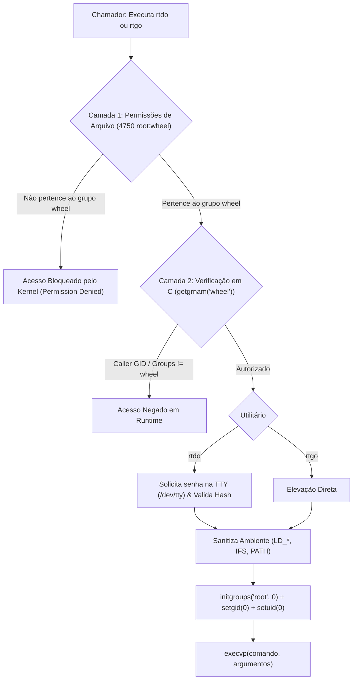

# ⚡ Core POSIX

<div align="center">

[](https://github.com/GabrielFrigo4/core-posix/actions/workflows/ci.yml)
[](LICENSE)
[](https://pubs.opengroup.org/onlinepubs/9699919799/)
[](https://en.cppreference.com/w/c/99)

_Suíte minimalista, segura e auditável de ferramentas e utilitários Unix em C puro._

</div>

---

## 📖 Visão Geral

O projeto **Core POSIX** (`core-posix`) reúne utilitários de sistema concebidos sob a filosofia clássica do Unix: ferramentas focadas, com base de código enxuta, livres de dependências externas inchadas, fáceis de auditar e estritamente aderentes ao padrão POSIX.

A suíte introduz dois executores de privilégios de alto desempenho com controle rígido de acesso:

- **`rtdo`** (_Root Do_): Executor de comandos com privilégio elevado mediante autenticação de senha via `/dev/tty`. Restrito ao grupo **`wheel`**.
- **`rtgo`** (_Root Go_): Executor imediato sem senha (_passwordless_), de latência ultrabaixa (< 1ms), com elevação segura restrita exclusivamente ao grupo **`wheel`**.

---

## 🧩 Utilitários da Suíte

| Utilitário          | Descrição                         | Autenticação              | Controle de Acesso      | Permissões        |
| :------------------ | :-------------------------------- | :------------------------ | :---------------------- | :---------------- |
| [**`rtdo`**](rtdo/) | Alternativa leve ao `sudo`/`doas` | Senha da TTY (`crypt`)    | `root` ou grupo `wheel` | `4750 root:wheel` |
| [**`rtgo`**](rtgo/) | Elevação imediata e sem senha     | Nenhuma (_Zero Password_) | `root` ou grupo `wheel` | `4750 root:wheel` |

---

## 🛡️ Modelo de Segurança em Duas Camadas

Ambos os utilitários operam sob um modelo de **defesa em profundidade** contra acessos não autorizados:



1. **Camada 1 (Kernel/Filesystem):** Binários instalados com `chown root:wheel` e `chmod 4750` (`rwsr-x---`). Usuários fora do grupo `wheel` não possuem sequer permissão de leitura ou execução.
2. **Camada 2 (Runtime C):** Validação programática das identidades primárias e secundárias (`getgroups`) em relação ao GID do grupo `wheel` (com fallback para `sudo` em distros derivadas de Debian).
3. **Higienização de Ambiente:** Expurgo obrigatório de `LD_PRELOAD`, `LD_LIBRARY_PATH`, `IFS` e imposição de `PATH` seguro.
4. **Isolamento de Grupos:** Invocação de `initgroups("root", 0)` antes de assumir credenciais de root.

---

## 🚀 Compilação e Instalação

### Pré-requisitos

- Compilador C (`gcc` ou `clang`)
- `make` compatível com POSIX
- Biblioteca criptográfica (`libcrypt-dev` em Linux; integrada na `libc` em FreeBSD)

### Compilação Padrão

```bash
# Compilar todos os utilitários da suíte
make all

# Compilar com sanitizers (AddressSanitizer + UndefinedBehaviorSanitizer)
CC=clang make debug
```

### Instalação no Sistema

Para instalar os binários com bit SUID restrito ao grupo `wheel` (`chmod 4750`) e as manpages correspondentes em `/usr/local`:

```bash
sudo make install
```

---

## 🧪 Quality Gates & Ganchos Git (.githooks)

O repositório inclui ganchos Git locais (`.githooks`) que impedem a inclusão de código fora de padrão, executando validações automáticas antes de cada commit: verificação de espaços em branco residuais, integridade de formatação (`clang-format` e `prettier`) e compilação estrita (`make check`).

Para que os scripts funcionem e o Git os execute, é necessário conceder permissão de execução via `chmod` e configurar o diretório no Git.

### Opção 1: Via Instalador Automatizado (Recomendado)

Conceda permissão de execução ao instalador e execute-o (ele ajustará as permissões dos hooks e registrará o caminho no Git automaticamente):

```bash
chmod +x .githooks/install.sh
./.githooks/install.sh
```

### Opção 2: Configuração Manual Passo a Passo

Caso prefira configurar manualmente sem o script instalador:

1. **Permissão de execução com `chmod`:**
   Conceda permissão de execução para todos os scripts do diretório `.githooks` (ou individualmente para o `pre-commit`):

    ```bash
    chmod 0755 .githooks/*
    # ou: chmod +x .githooks/pre-commit
    ```

2. **Ativação no Git:**
   Configure o repositório local para apontar os hooks para o diretório versionado `.githooks`:

    ```bash
    git config core.hooksPath .githooks
    ```

### Verificação Manual dos Gates

Para testar o script de pre-commit diretamente ou rodar a suíte completa de checagens:

```bash
# Executar o gancho de pre-commit diretamente
./.githooks/pre-commit

# Ou executar a validação completa via Makefile
make check
```

---

## 📚 Documentação Técnica

- 🏛️ [**ARCHITECTURE.md**](docs/ARCHITECTURE.md): Análise técnica do fluxo de privilégios, restrições e TTY.
- 🔐 [**SECURITY.md**](docs/SECURITY.md): Modelo de ameaças, mitigação de escalonamento e checklist.
- 🤖 [**AGENTS.md**](AGENTS.md): Diretrizes para agentes autônomos de IA trabalhando neste repositório.
- 🌐 [**ENVIRONMENT.md**](ENVIRONMENT.md): Requisitos de SO e matriz de compatibilidade.

---

## 📄 Licença

Distribuído sob a licença **MIT**. Veja [LICENSE](LICENSE) para mais detalhes.
