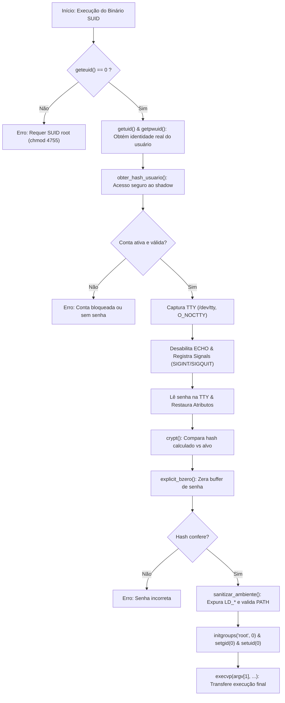

# 🏛️ Arquitetura e Ciclo de Execução

Visão aprofundada da mecânica de funcionamento, transições de privilégios e ciclo de vida dos processos na suíte `unix`, com ênfase no utilitário `msud`.

---

## ⚡ Fluxo de Execução do `msud`

O diagrama abaixo ilustra a transição de privilégios e o ciclo de vida defensivo adotado:

---

## 🛡️ Decisões de Design de Baixo Nível

### 1. Acesso Direto à TTY (`/dev/tty`)
Diferente de ler de `stdin` (que pode ser redirecionado através de pipes ou arquivos), a leitura de credenciais no `msud` acessa diretamente o nó `/dev/tty` do processo controlador com a flag `O_NOCTTY`. Isso previne:
- Injeção acidental ou maliciosa via pipes (`cat passwords.txt | msud ...`).
- Assunção indevida do terminal como terminal de controle.

### 2. Captura Atômica de Sinais
Se o usuário pressionar `Ctrl+C` no momento exato em que a flag `ECHO` está desativada, o tratador de sinal intercepta `SIGINT`, reaplica imediatamente a estrutura `g_saved_termios` no descritor aberto e conclui a terminação com `_exit(130)`.

### 3. Eliminação Residual com `initgroups`
No modelo Unix, um usuário pode pertencer a grupos secundários (ex: `wheel`, `docker`, `plugdev`). Quando um binário SUID assume a identidade de root via `setuid(0)` e `setgid(0)`, se não chamar explicitamente `initgroups("root", 0)`, o processo continuará pertencendo aos grupos secundários do usuário chamador, abrindo brechas de integridade. A chamada garante alinhamento estrito com os grupos de root.
