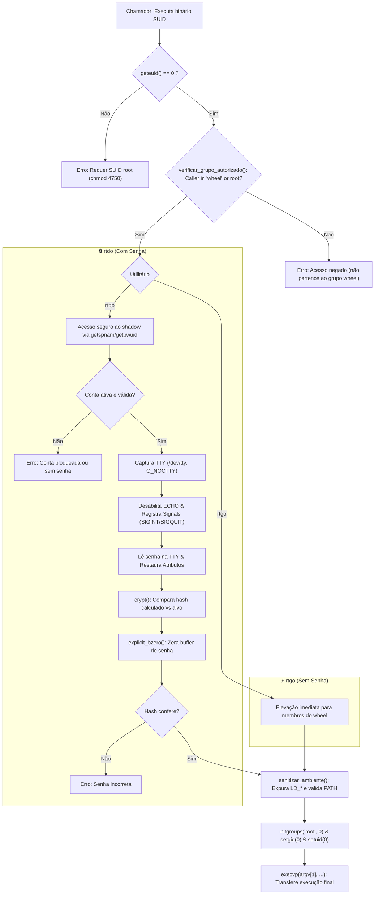

# 🏛️ Arquitetura e Ciclo de Execução

Visão aprofundada da mecânica de funcionamento, transições de privilégios e ciclo de vida dos processos na suíte `unix`, cobrindo os utilitários `rtdo` e `rtgo`.

---

## ⚡ Fluxo de Execução do `rtdo` e `rtgo`

---

## 🛡️ Decisões de Design de Baixo Nível

### 1. Restrição Estrita ao Grupo `wheel` (4750)

Para evitar que qualquer usuário sem privilégios possa explorar ou abusar dos utilitários:

- **Permissão de Arquivo:** `chmod 4750 root:wheel`. Usuários fora de `wheel` recebem `Permission Denied` diretamente no nível do kernel ao tentar ler ou invocar o binário.
- **Validação Programática:** Inspeciona o `getgid()` e a lista de grupos secundários retornada por `getgroups()` contra o GID de `wheel` (com fallback para `sudo` em distros como Ubuntu/Debian).

### 2. Acesso Direto à TTY (`/dev/tty`) em `rtdo`

A leitura de credenciais acessa diretamente o descritor `/dev/tty` com `O_NOCTTY`. Isso impede injeção via pipes (`stdin`) e garante que a entrada só venha do usuário interativo.

### 3. Captura Atômica de Sinais

Em `rtdo`, se o usuário interromper com `Ctrl+C` enquanto a flag `ECHO` estiver desligada, `SIGINT` restaura imediatamente o estado original do terminal antes de sair com código 130.

### 4. Isolamento Completo com `initgroups`

Ambos os utilitários invocam `initgroups("root", 0)` antes de `setgid(0)` e `setuid(0)` para garantir que nenhuma permissão de grupo secundário do usuário chamador seja retida no processo root.
